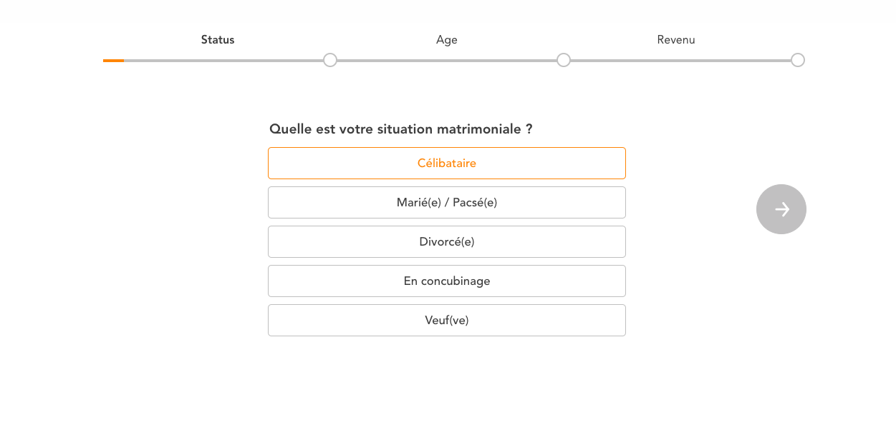
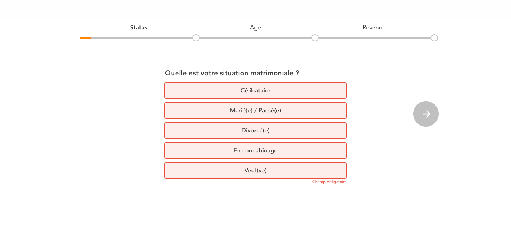
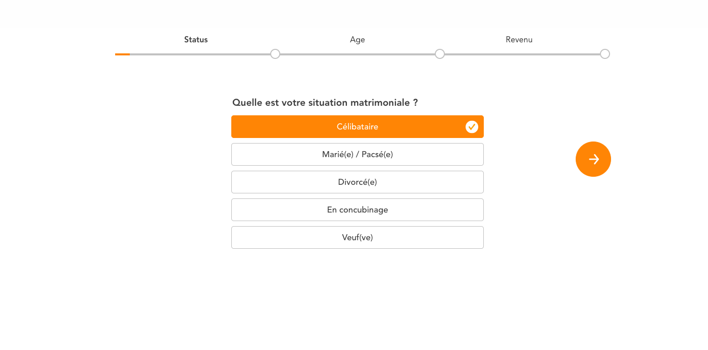
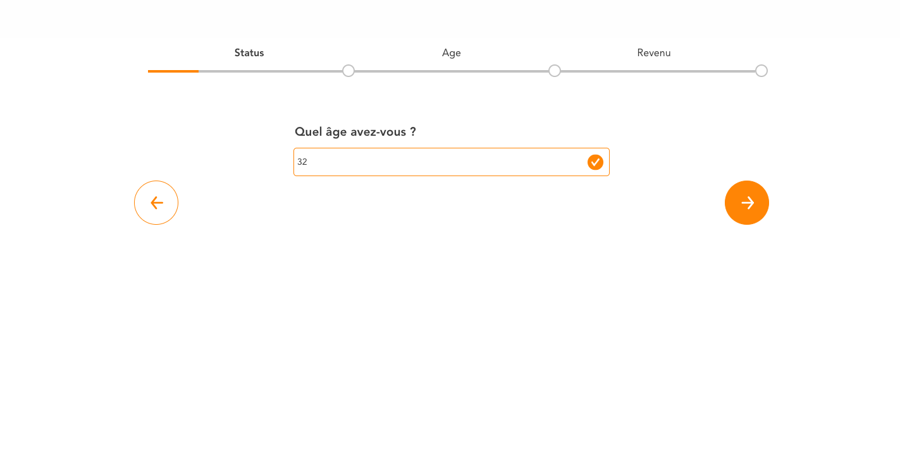
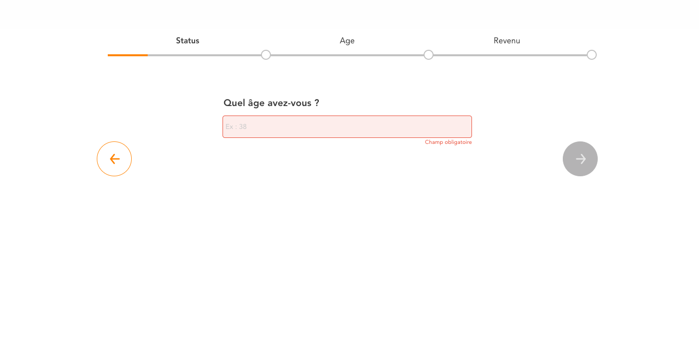

# Tacotax - Test technique Front
## Sommaire
1. Objectif
2. Techno
3. Spécificités
4. Images
5. Server
6. Prérequis

## Objectif :
L'objectif est de créer un slider présentant 3 slides avec les données fournies par l'api.

Description du slider :

* 3 slides
* Un bouton next pour arriver à la prochaine slide
* Un bouton prev pour arriver à la slide précédente
* Une progress bar présentant l'avancée du slider

(voir images pour design)

## Techno :
Le slider est a réaliser avec React.js.
L'intégration se fera avec au choix : Sass ou styled-component.

## Spécificités :
### slider
* On ne peut accéder à la prochaine slide que si nous avons sélectionné une valeur à la question de la slide
* Si on retourne à une slide précédente la valeur déjà entrée précédemment est sélectionnée/entrée et non pas vide

### bouton
* Le bouton next n'est pas présent pour la dernière slide mais un bouton submit
* Le bouton prev n'est pas présent pour la première slide

### Progress bar
* À la dernière slide la valeur de la progress bar n'est pas 100% (environ 90%)

### Input
* Si on clique sur next nous avons un message d'erreur demandant de remplir la donnée

## Images :
### Slider première slide


### Slider première slide error


### Slider première slide validate


### Slider seconde slide


### Slider seconde slide error


### Troisième slide ressemble à la deuxième


## Server :
Nous vous fournissons un serveur à lancer en local pour récupérer les données du slider.

Celui-ci vous fournit le call à faire sur `http://localhost:9888/api/questionnaire`

### Installation
```
	yarn / npm i
```

### Lancer le server
```
	yarn server / npm run server
```

## Prérequis
* Node
